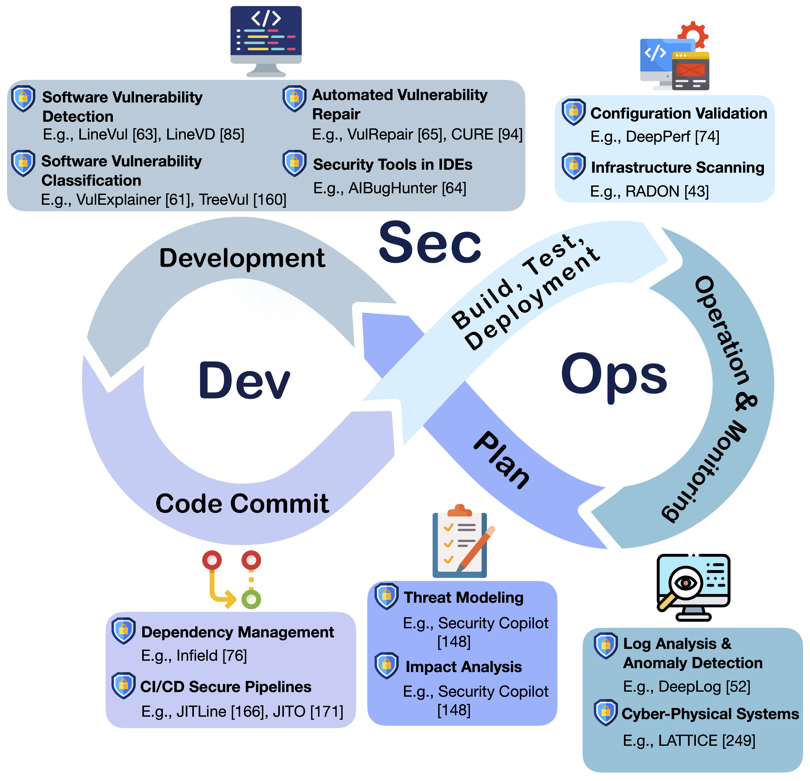

<div align="center">
<h2> Awesome AI (Machine Learning / Deep Learning) For DevSecOps</h2>
</div>

[](https://github.com/awsm-research/Awesome-AI4DevSecOps)


---

Recently, the advancement of artificial intelligence (AI) has revolutionized automation in various software domains, including software security. AI-driven security approaches, particularly those leveraging machine learning or deep learning, hold promise in automating security workflows. They could reduce manual efforts, which can be integrated into DevOps to ensure uninterrupted delivery speed and align with the DevSecOps paradigm simultaneously.

We identified 12 security tasks associated with the DevSecOps process and reviewed current AI-driven security approaches. Through this analysis, we uncovered 15 challenges faced by these approaches and outlined potential opportunities for future research.

<div align="center">

</div>

---

🦉 Comprehensive resources for our AI for DevSecOps survey, authored by [Michael Fu](https://michaelfu1998-create.github.io/), [Jirat Pasuksmit](https://www.linkedin.com/in/jirat-pasuksmit-1999b7b0/?originalSubdomain=au), and [Chakkrit Tantithamthavorn](https://chakkrit.com/)

👩‍🔧 Please let us know if you notice any mistakes or have any suggestions!

🚀 If you find this resource helpful, please consider to star this repository and cite our survey paper:
```
@article{fu2024ai,
  title={AI for DevSecOps: A Landscape and Future Opportunities},
  author={Fu, Michael and Pasuksmit, Jirat and Tantithamthavorn, Chakkrit},
  journal={arXiv preprint arXiv:2404.04839},
  year={2024}
}
```

## 📢 News
- 📌 [August-23-2024] First revision of our AI4DevSecOps survey is completed
- 📌 [April-07-2024] Our AI4DevSecOps survey (v1) is available on arXiv [📝](https://arxiv.org/abs/2404.04839)

## 🤝 Contributing to Awesome-AI4DevSecOps

**We welcome contributions from the community!**

If you have a valuable **resource, tool, or idea related to AI for DevSecOps**, please submit your PR using the following template.

🔥 This is a great opportunity to **share and promote your work, research, or projects with a wider audience!**

```markdown
# Description: [Briefly describe your contribution, its purpose, and relevance.]

# Type of Contribution
- [ ] Research Paper
- [ ] Dataset
- [ ] Tool/Library
- [ ] Tutorial/Guide
- [ ] Other (please specify):

# Paper/Resource Link: [Provide the link here]
```

We will review and merge your contribution if it is appropriate and relevant to our project.

Thank you for helping us improve Awesome-AI4DevSecOps!

---

##  Paper Collection
**Current Landscape of AI-Driven Security Appoaches in DevSecOps (Section 4 in our paper)**

###  Plan

- **Threat Modeling**
  - *No Relevant Publications Identified Using Our Defined Search Strategy*

- **Impact Analysis**
  - *No Relevant Publications Identified Using Our Defined Search Strategy*

###  Development

- **Software Vulnerability Detection (SVD)**
  - **`Recurrent Neural Network (RNN)`**
    - Automatic feature learning for predicting vulnerable software components (TSE, 2018) [📝](https://ieeexplore.ieee.org/abstract/document/8540022)
    - Automated vulnerability detection in source code using deep representation learning (ICMLA, 2018) [📝](https://ieeexplore.ieee.org/abstract/document/8614145)
    - Vuldeepecker: A deep learning-based system for vulnerability detection (NDSS, 2018) [📝](https://arxiv.org/abs/1801.01681)
    - Vuldeelocator: a deep learning-based fine-grained vulnerability detector (TDSC, 2021) [📝](https://ieeexplore.ieee.org/abstract/document/9416836)
    - VUDENC: vulnerability detection with deep learning on a natural codebase for Python (IST, 2022) [📝](https://www.sciencedirect.com/science/article/pii/S0950584921002421)
  - **`Text Convolutional Neural Network (TextCNN)`**
    - A software vulnerability detection method based on deep learning with complex network analysis and subgraph partition (IST, 2023) [📝](https://www.sciencedirect.com/science/article/pii/S0950584923001830)
  - **`Graph Neural Network (GNN)`**
    - Devign: Effective vulnerability identification by learning comprehensive program semantics via graph neural networks (NeurIPS, 2019) [📝](https://proceedings.neurips.cc/paper_files/paper/2019/hash/49265d2447bc3bbfe9e76306ce40a31f-Abstract.html)
    - Bgnn4vd: Constructing bidirectional graph neural-network for vulnerability detection (IST, 2021) [📝](https://www.sciencedirect.com/science/article/pii/S0950584921000586)
    - Deep learning based vulnerability detection: Are we there yet (TSE, 2021) [📝](https://ieeexplore.ieee.org/abstract/document/9448435/)
    - Vulnerability detection with fine-grained interpretations (FSE, 2021) [📝](https://dl.acm.org/doi/abs/10.1145/3468264.3468597)
    - LineVD: Statement-level vulnerability detection using graph neural networks (MSR, 2022) [📝](https://dl.acm.org/doi/abs/10.1145/3524842.3527949)
    - mVulPreter: A Multi-Granularity Vulnerability Detection System With Interpretations (TDSC, 2022) [📝](https://ieeexplore.ieee.org/abstract/document/9864301/)
    - VulChecker: Graph-based Vulnerability Localization in Source Code (USENIX, 2022) [📝](https://www.usenix.org/conference/usenixsecurity23/presentation/mirsky)
    - CPVD: Cross Project Vulnerability Detection Based On Graph Attention Network And Domain Adaptation (TSE, 2023) [📝](https://ieeexplore.ieee.org/abstract/document/10149539/)
    - DeepVD: Toward Class-Separation Features for Neural Network Vulnerability Detection (ICSE, 2023) [📝](https://ieeexplore.ieee.org/abstract/document/10172789/)
    - Learning Program Semantics for Vulnerability Detection via Vulnerability-Specific Inter-procedural Slicing (FSE, 2023) [📝](https://dl.acm.org/doi/abs/10.1145/3611643.3616351)
    - SedSVD: Statement-level software vulnerability detection based on Relational Graph Convolutional Network with subgraph embedding (IST, 2023) [📝](https://www.sciencedirect.com/science/article/pii/S0950584923000228)
  - **`Node2Vec`**
    - Enhancing Deep Learning-based Vulnerability Detection by Building Behavior Graph Model (ICSE, 2023) [📝](https://ieeexplore.ieee.org/abstract/document/10172844/)
  - **`Pre-trained Code Language Model (CLM) (Transformers)`**
    - Linevul: A transformer-based line-level vulnerability prediction (MSR, 2022) [📝](https://dl.acm.org/doi/abs/10.1145/3524842.3528452)
    - Vulnerability Detection by Learning from Syntax-Based Execution Paths of Code (TSE, 2023) [📝](https://ieeexplore.ieee.org/abstract/document/10153647/)
  - **`LM + GNN`**
    - VELVET: a noVel Ensemble Learning approach to automatically locate VulnErable sTatements (SANER, 2022) [📝](https://ieeexplore.ieee.org/abstract/document/9825786/)
    - Dataflow Analysis-Inspired Deep Learning for Efficient Vulnerability Detection (ICSE, 2023) [📝](https://dl.acm.org/doi/abs/10.1145/3597503.3623345)

<div align="center">
<b>Benchmarks used in evaluating AI-driven software vulnerability detection</b>
  
|                 Benchmark                | Year |  Granularity  | Programming Language | Real-World |  Synthesis |
|:----------------------------------------:|:----:|:-------------:|:--------------------:|:----------:|:----------:|
| [Firefox](https://link.springer.com/article/10.1007/s10664-011-9190-8)               | 2013 |      File     |        C, C++        | ✔ |            |
| [Android](https://ieeexplore.ieee.org/abstract/document/6860243/) | 2014 |      File     |         Java         | ✔ |            |
| [Draper](https://ieeexplore.ieee.org/abstract/document/8614145/)       | 2018 |    Function   |        C, C++        | ✔ | ✔ |
| [Vuldeepecker](https://arxiv.org/abs/1801.01681)   | 2018 |  Code Gadget  |        C, C++        | ✔ | ✔ |
| [Du et al.](https://ieeexplore.ieee.org/abstract/document/8812029/)                      | 2019 |    Function   |        C, C++        | ✔ |            |
| [Devign](https://proceedings.neurips.cc/paper_files/paper/2019/hash/49265d2447bc3bbfe9e76306ce40a31f-Abstract.html)             | 2019 |    Function   |        C, C++        | ✔ |            |
| [FUNDED](https://ieeexplore.ieee.org/abstract/document/9293321/)          | 2020 |    Function   |  C, Java, Swift, PHP | ✔ | ✔ |
| [Big-Vul](https://dl.acm.org/doi/abs/10.1145/3379597.3387501)                 | 2020 | Function/Line |        C, C++        | ✔ |            |
| [Reveal](https://ieeexplore.ieee.org/abstract/document/9448435/)        | 2021 |    Function   |        C, C++        | ✔ |            |
| [Cao et al.](https://www.sciencedirect.com/science/article/pii/S0950584921000586)                     | 2021 |    Function   |        C, C++        | ✔ |            |
| [D2A](https://ieeexplore.ieee.org/abstract/document/9402126/)                  | 2021 |    Function   |        C, C++        | ✔ |            |
| [Deepwukong](https://dl.acm.org/doi/abs/10.1145/3436877)    | 2021 |    Function   |        C, C++        | ✔ | ✔ |
| [Vuldeelocator](https://ieeexplore.ieee.org/abstract/document/9416836/) | 2021 |      Line     |        C, C++        | ✔ | ✔ |
| [VulCNN](https://dl.acm.org/doi/abs/10.1145/3510003.3510229)               | 2022 |    Function   |        C, C++        | ✔ | ✔ |
| [VUDENC](https://www.sciencedirect.com/science/article/pii/S0950584921002421)     | 2022 |     Token     |        Python        | ✔ |            |
| [DeepVD](https://ieeexplore.ieee.org/abstract/document/10172789/)             | 2023 |    Function   |        C, C++        | ✔ |            |
| [VulChecker](https://www.usenix.org/conference/usenixsecurity23/presentation/mirsky)   | 2023 |  Instruction  |        C, C++        | ✔ |            |
  
</div>

- **Software Vulnerability Classification (SVC)**
  - **`Machine Learning (ML)`**
    - Automation of vulnerability classification from its description using machine learning (ISCC, 2020) [📝](https://ieeexplore.ieee.org/abstract/document/9219568/)
    - A machine learning approach to classify security patches into vulnerability types (CNS, 2020) [📝](https://ieeexplore.ieee.org/abstract/document/9162237/)
  - **`RNN`**
    - Vuldeepecker: A deep learning-based system for vulnerability detection (NDSS, 2018) [📝](https://arxiv.org/abs/1801.01681)
    - μVulDeePecker: A Deep Learning-Based System for Multiclass Vulnerability Detection (TDSC, 2019) [📝](https://ieeexplore.ieee.org/abstract/document/8846081/)
  - **`Text Recurrent Convolutional Neural Network (TextRCNN)`**
    - DeKeDVer: A deep learning-based multi-type software vulnerability classification framework using vulnerability description and source code (IST, 2023) [📝](https://www.sciencedirect.com/science/article/pii/S0950584923001441)
  - **`Vanilla Transformer`**
    - Towards Vulnerability Types Classification Using Pure Self-Attention: A Common Weakness Enumeration Based Approach (CSE, 2021) [📝](https://ieeexplore.ieee.org/abstract/document/9724608/)
  - **`Pre-trained Language Model (LM) (Transformers)`**
    - V2w-bert: A framework for effective hierarchical multiclass classification of software vulnerabilities (DSAA, 2021) [📝](https://ieeexplore.ieee.org/abstract/document/9564227/)
    - Prediction of Vulnerability Characteristics Based on Vulnerability Description and Prompt Learning (SANER, 2023) [📝](https://ieeexplore.ieee.org/abstract/document/10123485/)
  - **`CLM`**
    - VulExplainer: A Transformer-based Hierarchical Distillation for Explaining Vulnerability Types (TSE, 2023) [📝](https://ieeexplore.ieee.org/abstract/document/10220166/)
    - AIBugHunter: A Practical tool for predicting, classifying and repairing software vulnerabilities (EMSE, 2023) [📝](https://link.springer.com/article/10.1007/s10664-023-10346-3)
  - **`CLM + RNN`**
    - Fine-grained commit-level vulnerability type prediction by CWE tree structure (ICSE, 2023) [📝](https://ieeexplore.ieee.org/abstract/document/10172785/)

<div align="center">
<b>Benchmarks used in evaluating AI-driven software vulnerability classification</b>
  
|              Benchmark             | Year | Granularity |   Programming Language   | Real-World |  Synthesis |
|:----------------------------------:|:----:|:-----------:|:------------------------:|:----------:|:----------:|
| [μVulDeePecker](https://ieeexplore.ieee.org/abstract/document/8846081/) | 2019 | Code Gadget |          C, C++          | ✔ | ✔ |
| [TreeVul](https://ieeexplore.ieee.org/abstract/document/10172785/)         | 2023 |    Commit   | C, C++, Java, and Python | ✔ |            |
  
</div>

- **Automated Vulnerability Repair (AVR)**
  - **`ML`**
    - Sqlifix: Learning based approach to fix sql injection vulnerabilities in source code (SANER, 2021) [📝](https://ieeexplore.ieee.org/abstract/document/9425978/)
  - **`CNN`**
    - Coconut: combining context-aware neural translation models using ensemble for program repair (ISSTA, 2020) [📝](https://dl.acm.org/doi/abs/10.1145/3395363.3397369)
  - **`RNN`**
    - Sequencer: Sequence-to-sequence learning for end-to-end program repair (TSE, 2019) [📝](https://ieeexplore.ieee.org/abstract/document/8827954/)
    - A controlled experiment of different code representations for learning-based program repair (EMSE, 2022) [📝](https://link.springer.com/article/10.1007/s10664-022-10223-5)
  - **`Tree-based RNN`**
    - Dlfix: Context-based code transformation learning for automated program repair (ICSE, 2020) [📝](https://dl.acm.org/doi/abs/10.1145/3377811.3380345)
  - **`GNN`**
    - Hoppity: Learning graph transformations to detect and fix bugs in programs (ICLR, 2020) [📝](https://par.nsf.gov/servlets/purl/10210341)
  - **`Vanilla Transformer`**
    - A syntax-guided edit decoder for neural program repair (FSE, 2021) [📝](https://dl.acm.org/doi/abs/10.1145/3468264.3468544)
    - Neural transfer learning for repairing security vulnerabilities in c code (TSE, 2022) [📝](https://ieeexplore.ieee.org/abstract/document/9699412/)
    - Seqtrans: automatic vulnerability fix via sequence to sequence learning (TSE, 2022) [📝](https://ieeexplore.ieee.org/abstract/document/9729554/)
    - Tare: Type-aware neural program repair (ICSE, 2023) [📝](https://ieeexplore.ieee.org/abstract/document/10172781/)
  - **`CLM`**
    - Cure: Code-aware neural machine translation for automatic program repair (ICSE, 2021) [📝](https://ieeexplore.ieee.org/abstract/document/9401997/)
    - Applying codebert for automated program repair of java simple bugs (MSR, 2021) [📝](https://ieeexplore.ieee.org/abstract/document/9463106/)
    - Tfix: Learning to fix coding errors with a text-to-text transformer (PMLR, 2021) [📝](http://proceedings.mlr.press/v139/berabi21a.html)
    - VulRepair: a T5-based automated software vulnerability repair (FSE, 2022) [📝](https://dl.acm.org/doi/abs/10.1145/3540250.3549098)
    - Improving automated program repair with domain adaptation (TOSEM, 2022) [📝](https://dl.acm.org/doi/abs/10.1145/3631972)
    - Vision Transformer-Inspired Automated Vulnerability Repair (TOSEM, 2023) [📝](https://dl.acm.org/doi/abs/10.1145/3632746)
    - Enhancing Code Language Models for Program Repair by Curricular Fine-tuning Framework (ICSME, 2023) [📝](https://ieeexplore.ieee.org/abstract/document/10336339/)
    - Pre-trained model-based automated software vulnerability repair: How far are we? (TDSC, 2023) [📝](https://ieeexplore.ieee.org/abstract/document/10232867/)
    - Examining zero-shot vulnerability repair with large language models (SP, 2023) [📝](https://ieeexplore.ieee.org/abstract/document/10179324/)
    - Inferfix: End-to-end program repair with llms (FSE, 2023) [📝](https://dl.acm.org/doi/10.1145/3611643.3613892)
    - Unifying Defect Prediction, Categorization, and Repair by Multi-Task Deep Learning (ASE, 2023) [📝](https://ieeexplore.ieee.org/abstract/document/10298436/)

<div align="center">
<b>Benchmarks used in evaluating AI-driven just-in-time (JIT) automated program/vulnerability repair</b>
  
|                 Benchmark                | Year | Programming Language | Real-World |  Synthesis |
|:----------------------------------------:|:----:|:--------------------:|:----------:|:----------:|
| [Defects4J](https://dl.acm.org/doi/abs/10.1145/2610384.2628055)       | 2014 |         Java         | ✔ |            |
| [ManyBugs](https://ieeexplore.ieee.org/abstract/document/7153570/)           | 2015 |           C          | ✔ |            |
| [BugAID](https://dl.acm.org/doi/abs/10.1145/2950290.2950308)       | 2016 |      JavaScript      | ✔ |            |
| [QuixBugs](https://dl.acm.org/doi/abs/10.1145/3135932.3135941)          | 2017 |     Java, Python     | ✔ |            |
| [CodeFlaws](https://ieeexplore.ieee.org/abstract/document/7965296/)        | 2017 |           C          | ✔ |            |
| [Bugs.jar](https://dl.acm.org/doi/abs/10.1145/3196398.3196473)             | 2018 |         Java         | ✔ |            |
| [SequenceR](https://ieeexplore.ieee.org/abstract/document/8827954/)       | 2019 |         Java         | ✔ |            |
| [Bugs2Fix](https://dl.acm.org/doi/abs/10.1145/3340544)      | 2019 |         Java         | ✔ |            |
| [ManySStuBs4J](https://dl.acm.org/doi/abs/10.1145/3379597.3387491) | 2020 |         Java         | ✔ |            |
| [Hoppity](https://par.nsf.gov/servlets/purl/10210341)        | 2020 |      JavaScript      | ✔ |            |
| [CodeXGLUE](https://arxiv.org/abs/2102.04664)         | 2021 |         Java         | ✔ | ✔ |
| [TFix](http://proceedings.mlr.press/v139/berabi21a.html)               | 2021 |      JavaScript      | ✔ |            |
| [VRepair](https://ieeexplore.ieee.org/abstract/document/9699412/)            | 2022 |        C, C++        | ✔ |            |
| [Namavar et al.](https://link.springer.com/article/10.1007/s10664-022-10223-5)              | 2022 |      JavaScript      | ✔ |            |
| [Pearce et al.](https://ieeexplore.ieee.org/abstract/document/10179324/)                | 2023 |        C, C++        | ✔ | ✔ |
| [Function-SStuBs4J](https://ieeexplore.ieee.org/abstract/document/10298436/)  | 2023 |         Java         | ✔ |            |
| [InferFix](https://dl.acm.org/doi/abs/10.1145/3611643.3613892)          | 2023 |       Java, C#      | ✔ |            |

</div>

- **Security Tools in IDEs**
  - **`LM-based Security Tool`**
    - AIBugHunter: A Practical tool for predicting, classifying and repairing software vulnerabilities (EMSE, 2023) [📝](https://link.springer.com/article/10.1007/s10664-023-10346-3)

###  Code Commit

- **Dependency Management**
  - *No Relevant Publications Identified Using Our Defined Search Strategy*

- **CI/CD Secure Pipelines**
  - **`ML`**
    - Improving missing issue-commit link recovery using positive and unlabeled data (ASE, 2017) [📝](https://ieeexplore.ieee.org/abstract/document/8115627/)
    - MULTI: Multi-objective effort-aware just-in-time software defect prediction (IST, 2018) [📝](https://www.sciencedirect.com/science/article/pii/S0950584917304627?casa_token=3Seqv31xdeEAAAAA:SWdx5-v8-q8sIXClT0QPvcP9xfpDhXXqEfXBr0SUpPHwviZ8kWvvzYWLt9f1MjjI4cxOUxybjzA)
    - Class imbalance evolution and verification latency in just-in-time software defect prediction (ICSE, 2019) [📝](https://ieeexplore.ieee.org/abstract/document/8812072/)
    - Fine-grained just-in-time defect prediction (JSS, 2019) [📝](https://www.sciencedirect.com/science/article/pii/S0164121218302656?casa_token=5Fk9aT_H2P4AAAAA:xHQn14M4yeZFBmB-siy0aJKFGBROeGc76e78ieiJxadU3J9a3zwk1oML1zQtk57ZnLHYTTJCJLk)
    - Effort-aware semi-supervised just-in-time defect prediction (IST, 2020) [📝](https://www.sciencedirect.com/science/article/pii/S0950584920301324?casa_token=OgCOLkYyc7cAAAAA:FW7uZ8qnPJX5nzA6fr1QtC0tUWRFeejMJkwGs_fsqJzbIQy-kA8jmT8-KyNJxzsy4lwsgswhGZA)
    - Just-in-time defect identification and localization: A two-phase framework (TSE, 2020) [📝](https://ieeexplore.ieee.org/abstract/document/9026802/)
    - Adapting bug prediction models to predict reverted commits at Wayfair (FSE, 2020) [📝](https://dl.acm.org/doi/abs/10.1145/3368089.3417062)
    - JITLine: A simpler, better, faster, finer-grained just-in-time defect prediction (MSR, 2021) [📝](https://ieeexplore.ieee.org/abstract/document/9463103/)
    - Enhancing just-in-time defect prediction using change request-based metrics (SANER, 2021) [📝](https://ieeexplore.ieee.org/abstract/document/9426021/)
  - **`Explainable AI (XAI) For ML`**
    - Pyexplainer: Explaining the predictions of just-in-time defect models (ASE, 2021) [📝](https://ieeexplore.ieee.org/abstract/document/9678763/)
  - **`RNN`**
    - DeepLink: Recovering issue-commit links based on deep learning (JSS, 2019) [📝](https://www.sciencedirect.com/science/article/pii/S0164121219301803?casa_token=rgF6wMa1G3wAAAAA:QpWRYBH3U2m45gPkDTvdvUN4n__MM4YxURp7kwXVE9ABHvY_BrLrJb2x7mooBbHHQTX-kCjD8nw)
    - Deeplinedp: Towards a deep learning approach for line-level defect prediction (TSE, 2022) [📝](https://ieeexplore.ieee.org/abstract/document/9689967/)
  - **`Tree-based RNN`**
    - Lessons learned from using a deep tree-based model for software defect prediction in practice (MSR, 2019) [📝](https://ieeexplore.ieee.org/abstract/document/8816787/)
  - **`Vanilla Transformer`**
    - Deep just-in-time defect localization (TSE, 2021) [📝](https://ieeexplore.ieee.org/abstract/document/9653844/)
  - **`LM`**
    - BTLink: automatic link recovery between issues and commits based on pre-trained BERT model (EMSE, 2023) [📝](https://link.springer.com/article/10.1007/s10664-023-10342-7)
  - **`CLM`**
    - EALink: An Efficient and Accurate Pre-trained Framework for Issue-Commit Link Recovery (ASE, 2023) [📝](https://ieeexplore.ieee.org/abstract/document/10298434/) 
  - **`ML-based Just-In-Time (JIT) Software Defect Prediction (SDP) Tool`**
    - JITBot: an explainable just-in-time defect prediction bot (ASE, 2020) [📝](https://dl.acm.org/doi/abs/10.1145/3324884.3415295)
    - JITO: a tool for just-in-time defect identification and localization (FSE, 2020) [📝](https://dl.acm.org/doi/abs/10.1145/3368089.3417927)
  - **`ML-based Change Analysis Tool`**
    - Rex: Preventing bugs and misconfiguration in large services using correlated change analysis (USENIX, 2020) [📝](https://www.usenix.org/conference/nsdi20/presentation/mehta)

<div align="center">
<b>Benchmarks used in evaluating AI-driven just-in-time (JIT) software defect prediction</b>
  
|                Benchmark                | Year | Granularity |      Programming Language      | Real-World | Synthesis |
|:---------------------------------------:|:----:|:-----------:|:------------------------------:|:----------:|:---------:|
| [PROMISE](http://promise.site.uottawa.ca/SERepository/)    | 2007 |    Commit   |              Java              | ✔ |           |
| [Kamei et al.](https://ieeexplore.ieee.org/abstract/document/6341763/)                  | 2012 |    Commit   | C, C++, Java, JavaScript, Perl | ✔ |           |
| [Qt & OpenStack](https://dl.acm.org/doi/abs/10.1145/3180155.3182514)  | 2018 | Commit/Line |           C++, Python          | ✔ |           |
| [Cabral et al.](https://ieeexplore.ieee.org/abstract/document/8812072/)                 | 2019 | Commit/File |    Java, JavaScript, Python    | ✔ |           |
| [Yan et al.](https://ieeexplore.ieee.org/abstract/document/9026802/)                     | 2020 | Commit/File |              Java              | ✔ |           |
| [Wattanakriengkrai et al.](https://ieeexplore.ieee.org/abstract/document/9193975/) | 2020 |    Commit   |              Java              | ✔ |           |
| [Suh](https://dl.acm.org/doi/abs/10.1145/3368089.3417062)                 | 2020 | Commit/File |         JavaScript, PHP        | ✔ |           |
  
</div>

###  Build, Test, and Deployment

- **Configuration Validation**
  - **`ML`**
    - Tuning configuration of apache spark on public clouds by combining multi-objective optimization and performance prediction model (JSS, 2021) [📝](https://www.sciencedirect.com/science/article/pii/S0164121221001254?casa_token=7_lchxrmCgYAAAAA:9jGPfiTNqUReQpCcU0TVhgn0jZO4sPu3Px3Dsebjy26E2n7J8QBjMbRrzIWI7aL7uI325Qe4fEg)
    - KGSecConfig: A Knowledge Graph Based Approach for Secured Container Orchestrator Configuration (SANER, 2022) [📝](https://ieeexplore.ieee.org/abstract/document/9825815/)
    - CoMSA: A Modeling-Driven Sampling Approach for Configuration Performance Testing (ASE, 2023) [📝](https://ieeexplore.ieee.org/abstract/document/10298456/)
  - **`Feed-Forward Neural Network (FFNN)`**
    - DeepPerf: Performance prediction for configurable software with deep sparse neural network (ICSE, 2019) [📝](https://ieeexplore.ieee.org/abstract/document/8811988/)
  - **`Generative Adversarial Network (GAN)`**
    - ACTGAN: automatic configuration tuning for software systems with generative adversarial networks (ASE, 2019) [📝](https://ieeexplore.ieee.org/abstract/document/8952456/)
    - Perf-AL: Performance prediction for configurable software through adversarial learning (ESEM, 2020) [📝](https://dl.acm.org/doi/abs/10.1145/3382494.3410677)

- **Infrastructure Scanning**
  - **`ML`**
    - Characterizing defective configuration scripts used for continuous deployment (ICST, 2018) [📝](https://ieeexplore.ieee.org/abstract/document/8367034/)
    - Source code properties of defective infrastructure as code scripts (IST, 2019) [📝](https://www.sciencedirect.com/science/article/pii/S0950584919300965?casa_token=BBKfgIWqM1sAAAAA:tjMVyNhbG_Ttbi2NDxC1EB2QLn3Bw2Z3fDzk-YI4Fve1kcw9Ofyfl9yzzHN_uTI9U9aLyDE6HJI)
    - Within-project defect prediction of infrastructure-as-code using product and process metrics (TSE, 2021) [📝](https://ieeexplore.ieee.org/abstract/document/9321740/)
  - **`Word2Vec-CBOW (Continuous Bag of Words)`**
    - FindICI: Using machine learning to detect linguistic inconsistencies between code and natural language descriptions in infrastructure-as-code (EMSE, 2022) [📝](https://link.springer.com/article/10.1007/s10664-022-10215-5)

<div align="center">
<b>Benchmarks used in evaluating AI-driven infrastructure as code</b>
  
|            Benchmark           | Year | Real-World |  Synthesis |
|:------------------------------:|:----:|:----------:|:----------:|
| [Rahman and Williams](https://ieeexplore.ieee.org/abstract/document/8367034/) | 2018 | ✔ |            |
| [Rahman and Williams](https://www.sciencedirect.com/science/article/pii/S0950584919300965)         | 2019 | ✔ |            |
| [Dalla et al.](https://ieeexplore.ieee.org/abstract/document/9321740/)          | 2021 | ✔ |            |
| [Borovits et al.](https://link.springer.com/article/10.1007/s10664-022-10215-5)      | 2022 |            | ✔ |
  
</div>

###  Operation & Monitoring

- **Log Analysis & Anomaly Detection**
  - **`ML`**
    - An anomaly detection system based on variable N-gram features and one-class SVM (IST, 2017) [📝](https://www.sciencedirect.com/science/article/pii/S0950584917304548?casa_token=WP6-f5DpBgkAAAAA:mqDVK12ncXofHOu97IQ8hywrGSIA243iH5Uqr-yyCl0RP_oeJA_dUczXUeO9beRKcjDtBNAD7-Y)
    - Anomaly detection and diagnosis for cloud services: Practical experiments and lessons learned (JSS, 2018) [📝](https://www.sciencedirect.com/science/article/pii/S0164121218300256?casa_token=nySUhBS7v-sAAAAA:nv8WPicbdkrFyfDolBcSEuTmNmF64Xc8W8qYcvV8oDc-zgFGWICUdHJvad96xzHlI9OB90fXLIo)
    - Adaptive performance anomaly detection in distributed systems using online svms (TDSC, 2018) [📝](https://ieeexplore.ieee.org/abstract/document/8329134/)
    - Log-based anomaly detection with robust feature extraction and online learning (TIFS, 2021) [📝](https://ieeexplore.ieee.org/abstract/document/9330769/)
    - Try with Simpler--An Evaluation of Improved Principal Component Analysis in Log-based Anomaly Detection (TOSEM, 2023) [📝](https://dl.acm.org/doi/abs/10.1145/3644386)
    - On the effectiveness of log representation for log-based anomaly detection (EMSE, 2023) [📝](https://link.springer.com/article/10.1007/s10664-023-10364-1)
  - **`RNN`**
    - Deeplog: Anomaly detection and diagnosis from system logs through deep learning (CCS, 2017) [📝](https://dl.acm.org/doi/abs/10.1145/3133956.3134015)
    - Robust log-based anomaly detection on unstable log data (FSE, 2019) [📝](https://dl.acm.org/doi/abs/10.1145/3338906.3338931)
    - Loganomaly: Unsupervised detection of sequential and quantitative anomalies in unstructured logs (IJCAI, 2019) [📝](https://nkcs.iops.ai/wp-content/uploads/2019/06/paper-IJCAI19-LogAnomaly.pdf)
    - Anomaly detection in operating system logs with deep learning-based sentiment analysis (TDSC, 2020) [📝](https://ieeexplore.ieee.org/abstract/document/9259061/)
    - SwissLog: Robust anomaly detection and localization for interleaved unstructured logs (TDSC, 2022) [📝](https://ieeexplore.ieee.org/abstract/document/9744513/)
    - DeepSyslog: Deep Anomaly Detection on Syslog Using Sentence Embedding and Metadata (TIFS, 2022) [📝](https://ieeexplore.ieee.org/abstract/document/9865986/)
    - LogOnline: A Semi-Supervised Log-Based Anomaly Detector Aided with Online Learning Mechanism (ASE, 2023) [📝](https://ieeexplore.ieee.org/abstract/document/10298477/)
    - On the effectiveness of log representation for log-based anomaly detection (EMSE, 2023) [📝](https://link.springer.com/article/10.1007/s10664-023-10364-1)
  - **`RNN-based AutoEncoder (AE)`**
    - Lifelong anomaly detection through unlearning (CCS, 2019) [📝](https://dl.acm.org/doi/abs/10.1145/3319535.3363226)
    - Recompose event sequences vs. predict next events: A novel anomaly detection approach for discrete event logs (CCS, 2021) [📝](https://dl.acm.org/doi/abs/10.1145/3433210.3453098)
  - **`GNN`**
    - LogGraph: Log Event Graph Learning Aided Robust Fine-Grained Anomaly Diagnosis (TDSC, 2023) [📝](https://ieeexplore.ieee.org/abstract/document/10175570/)
  - **`Vanilla Transformer`**
    - Log-based anomaly detection without log parsing (ASE, 2021) [📝](https://ieeexplore.ieee.org/abstract/document/9678773/)
  - **`XAI For Deep Learning (DL)`**
    - Deepaid: Interpreting and improving deep learning-based anomaly detection in security applications (CCS, 2021) [📝](https://dl.acm.org/doi/abs/10.1145/3460120.3484589)
    - Towards an interpretable autoencoder: A decision-tree-based autoencoder and its application in anomaly detection (TDSC, 2022) [📝](https://ieeexplore.ieee.org/abstract/document/9705133/)
  - **`Conditional Diffusion Model`**
    - Maat: Performance Metric Anomaly Anticipation for Cloud Services with Conditional Diffusion (ASE, 2023) [📝](https://ieeexplore.ieee.org/abstract/document/10298323/)

<div align="center">
<b>Benchmarks used in evaluating AI-driven log analysis and anomaly detection</b>
  
|              Benchmark              | Year | Real-World |  Synthesis |
|:-----------------------------------:|:----:|:----------:|:----------:|
| [Yahoo! Webscope](https://webscope.sandbox.yahoo.com/)        | 2006 | ✔ | ✔ |
| [BGL](https://ieeexplore.ieee.org/abstract/document/4273008/) | 2007 | ✔ |            |
| [HDFS](https://dl.acm.org/doi/abs/10.1145/1629575.1629587)         | 2009 | ✔ |            |
| [ADFA-LD](https://ieeexplore.ieee.org/abstract/document/6555301/) | 2013 |            | ✔ |
| [SDS](https://ieeexplore.ieee.org/abstract/document/7371584/)            | 2015 |            | ✔ |
| [UNSW-NB15](https://ieeexplore.ieee.org/abstract/document/7348942/)   | 2015 |            | ✔ |
| [OpenStack](https://dl.acm.org/doi/abs/10.1145/3133956.3134015)      | 2017 | ✔ |            |
| [Microsoft](https://dl.acm.org/doi/abs/10.1145/3338906.3338931)    | 2019 | ✔ |            |
| [LogHub](https://github.com/logpai/loghub)          | 2020 | ✔ |            |
| [Studiawan et al.](https://ieeexplore.ieee.org/abstract/document/9259061/)          | 2020 | ✔ |            |
| [Yang et al.](https://dl.acm.org/doi/abs/10.1145/3644386)                   | 2023 | ✔ |            |
  
</div>

- **Cyber-Physical Systems**
  - **`ML`**
    - TABOR: A graphical model-based approach for anomaly detection in industrial control systems (CCS, 2018) [📝](https://dl.acm.org/doi/abs/10.1145/3196494.3196546)
    - Adaptive-Correlation-aware Unsupervised Deep Learning for Anomaly Detection in Cyber-physical Systems (TDSC, 2023) [📝](https://ieeexplore.ieee.org/abstract/document/10265213/)
  - **`RNN + GNN`**
    - Digital Twin-based Anomaly Detection with Curriculum Learning in Cyber-physical Systems (TOSEM, 2023) [📝](https://dl.acm.org/doi/abs/10.1145/3582571)
  - **`GAN`**
    - Digital twin-based anomaly detection in cyber-physical systems (ICST, 2021) [📝](https://ieeexplore.ieee.org/abstract/document/9438560/)
  - **`Variational AutoEncoder (VAE)`**
    - From Point-wise to Group-wise: A Fast and Accurate Microservice Trace Anomaly Detection Approach (FSE, 2023) [📝](https://dl.acm.org/doi/abs/10.1145/3611643.3613861)
  - **`Vanilla Transformer`**
    - Twin Graph-Based Anomaly Detection via Attentive Multi-Modal Learning for Microservice System (ASE, 2023) [📝](https://ieeexplore.ieee.org/abstract/document/10298321/)
  - **`LM + RNN`**
    - KDDT: Knowledge Distillation-Empowered Digital Twin for Anomaly Detection (FSE, 2023) [📝](https://dl.acm.org/doi/abs/10.1145/3611643.3613879)

<div align="center">
<b>Benchmarks used in evaluating AI-driven log analysis and anomaly detection</b>
  
|                     Benchmark                    | Year | Real-World |  Synthesis |
|:------------------------------------------------:|:----:|:----------:|:----------:|
| [Gas Pipeline Dataset](https://sites.google.com/a/uah.edu/tommy-morris-uah/ics-data-sets) | 2015 | ✔ |            |
| [SWaT](https://ieeexplore.ieee.org/abstract/document/7469060/)                       | 2016 | ✔ |            |
| [WADI](https://dl.acm.org/doi/abs/10.1145/3055366.3055375)                        | 2017 | ✔ |            |
| [BATADAL](https://ascelibrary.org/doi/abs/10.1061/(ASCE)WR.1943-5452.0000969)                | 2018 |            | ✔ |
| [MSDS](https://ieeexplore.ieee.org/abstract/document/10025560/)                      | 2023 | ✔ |            |
  
</div>

---

<div align="center">
  
## Identified 15 Challenges of AI-Driven Security Approach in DevSecOps (Section 5 in our paper)

|         DevOps Step         |        Identified Security Task       |                      Themes of Challenges                      |
|:---------------------------:|:-------------------------------------:|:--------------------------------------------------------------:|
|             Plan            |            Threat Modeling            |                                -                               |
|                             |        Software Impact Analysis       |                                -                               |
|         Development         |    Software Vulnerability Detection   | C1-1 - Data Imbalance                                          |
|                             |                                       | C4 - Cross Project                                             |
|                             |                                       | C5 - MBU Vulnerabilities                                       |
|                             |                                       | C6 - Data Quality                                              |
|                             | Software Vulnerability Classification | C1-2 - Data Imbalance                                          |
|                             |                                       | C7 - Incompleted CWE Tree                                      |
|                             |     Automated Vulnerability Repair    | C2-1 - Model Explainability                                    |
|                             |                                       | C8 - Sequence Length and Computing Resource                    |
|                             |                                       | C9 - Loss of Pre-Trained Knowledge                             |
|                             |                                       | C10 - Automated Repair on Real-World Scenarios                 |
|                             |         Security Tools in IDEs        | C3-1 - Lack of AI Security Tooling in IDEs                     |
|         Code Commit         |         CI/CD Secure Pipelines        | C2-2 - Model Explainability                                    |
|                             |                                       | C3-2 - Lack of AI Security Tooling in CI/CD                    |
|                             |                                       | C11 - The Use of RNNs                                          |
| Build, Test, and Deployment |        Configuration Validation       | C12 - Complex Feature Space                                    |
|                             |        Infrastructure Scanning        | C3-3 - Lack of AI Security Tooling for Infrastructure Scanning |
|                             |                                       | C13 - Manual Feature Engineering                               |
|   Operation and Monitoring  |   Log Analysis and Anomaly Detection  | C2-3 - Model Explainability                                    |
|                             |                                       | C14 - Normality Drift for Zero-Positive Anomaly Detection      |
|                             |         Cyber-Physical Systems        | C15 - Monitoring Multiple Cyber-Attacks Simultaneously         |

</div>

---

<div align="center">
  
## Identified 15 Research Directions of AI-Driven Security Approach in DevSecOps (Section 5 in our paper)

|         DevOps Step         |        Identified Security Task       |                         Research Opportunity                        |
|:---------------------------:|:-------------------------------------:|:-------------------------------------------------------------------:|
|             Plan            |            Threat Modeling            |                                  -                                  |
|                             |        Software Impact Analysis       |                                  -                                  |
|         Development         |    Software Vulnerability Detection   | R1-1 - Data augmentation and logit adjustment                       |
|                             |                                       | R4 - Evaluate cross-project SVD with diverse CWE-IDs                |
|                             |                                       | R5 - Evaluate SVD on MBU vulnerabilities                            |
|                             |                                       | R6 - Address data inaccuracy from automatic data collection.        |
|                             | Software Vulnerability Classification | R1-2 - Meta-learning and LLMs                                       |
|                             |                                       | R7 - Develop advanced tree-based SVC                                |
|                             |     Automated Vulnerability Repair    | R2-1 - Evidence-based explainable AI (XAI)                          |
|                             |                                       | R8 - Explore transformer variants that can process longer sequences |
|                             |                                       | R9 - Explore different training paradigms during fine-tuning        |
|                             |                                       | R10 - Address limitations of LLMs                                   |
|                             |         Security Tools in IDEs        | R3-1 - AI tool deployment and comprehensive tool evaluation         |
|         Code Commit         |         CI/CD Secure Pipelines        | R2-2 - Explainable AI (XAI) for DL Models                           |
|                             |                                       | R3-2 - AI tool deployment in CI/CD pipelines                        |
|                             |                                       | R11 - Explore LMs and LLMs                                          |
| Build, Test, and Deployment |        Configuration Validation       | R12 - Explore transformers for tabular data                         |
|                             |        Infrastructure Scanning        | R3-3 - AI tool deployment and post-deployment evaluation            |
|                             |                                       | R13 - Explore DL-based techniques                                   |
|   Operation and Monitoring  |   Log Analysis and Anomaly Detection  | R2-3 - Explainable AI (XAI) for ML Models                           |
|                             |                                       | R14 - Enhance normality drift detection                             |
|                             |         Cyber-Physical Systems        | R15 - Distributed anomaly detection and multi-agent systems         |

</div>

---
